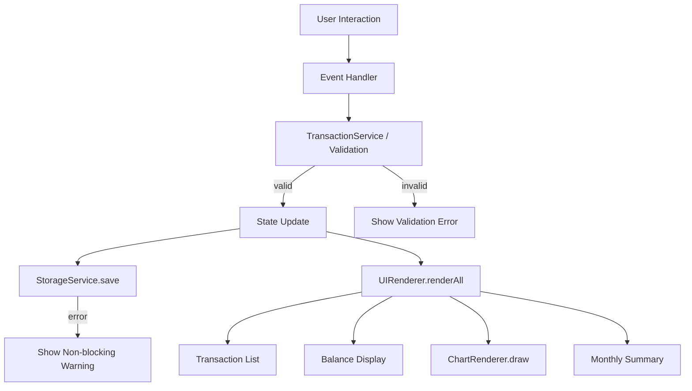

# Design Document

## Overview

The Expense and Budget Visualizer is a single-page, client-side web application built with plain HTML, CSS, and vanilla JavaScript. There is no build step, no bundler, and no external JavaScript libraries. All state lives in memory during a session and is persisted to `localStorage` between sessions.

The application is structured around a single HTML file that loads one CSS file (`css/styles.css`) and one JavaScript file (`js/app.js`). All rendering, event handling, state management, and storage I/O are handled inside `js/app.js`.

### Key Design Decisions

- **No frameworks or libraries** — keeps the bundle size at zero and removes any dependency risk. Vanilla DOM APIs are sufficient for the feature set.
- **Single JS file** — required by the spec. All modules are expressed as plain functions and closures within one file, organized by concern (state, storage, rendering, events).
- **Canvas-based pie chart** — the spending distribution chart is drawn on an HTML `<canvas>` element using the 2D Context API. No SVG or external chart library is used.
- **localStorage as the only persistence layer** — all reads and writes are synchronous and wrapped in try/catch to handle unavailability gracefully.
- **CSS custom properties for theming** — dark/light mode is implemented by toggling a `data-theme` attribute on `<html>`, which switches a set of CSS custom property values. This keeps all theme logic in CSS and avoids inline style manipulation.

---

## Architecture

The application follows a simple **unidirectional data flow**:

```
User Action → Event Handler → State Mutation → Storage Write → Re-render
```

There is no virtual DOM or reactive framework. Every state change triggers an explicit re-render of the affected UI regions.

### Module Organization (within `js/app.js`)

```
js/app.js
├── Constants          — key names, defaults, limits
├── State              — in-memory application state object
├── StorageService     — read/write/clear helpers wrapping localStorage
├── TransactionService — business logic (add, delete, sort, filter)
├── ChartRenderer      — pie chart drawing on <canvas>
├── UIRenderer         — DOM update functions (list, balance, summary, form)
├── EventHandlers      — wires DOM events to service + renderer calls
└── init()             — bootstraps the app on DOMContentLoaded
```

### File Structure

```
/
├── index.html
├── css/
│   └── styles.css
└── js/
    └── app.js
```

### Data Flow Diagram



---

## Components and Interfaces

### 1. State Object

The single source of truth held in memory:

```js
const state = {
  transactions: [], // Transaction[]
  categories: [], // string[] — includes defaults + custom
  sortOrder: "none", // 'none' | 'amount-asc' | 'amount-desc' | 'category-az'
  activeMonth: null, // null | { year: number, month: number }  (1-indexed month)
  theme: "light", // 'light' | 'dark'
};
```

### 2. StorageService

```js
StorageService = {
  loadTransactions()  → Transaction[] | []   // try/catch, returns [] on error
  saveTransactions(transactions)             // try/catch, shows warning on error
  loadCategories()    → string[]             // try/catch, returns defaults on error
  saveCategories(categories)                 // try/catch, shows warning on error
  loadTheme()         → 'light' | 'dark'     // try/catch, returns 'light' on error
  saveTheme(theme)                           // try/catch, silent on error
}
```

### 3. TransactionService

```js
TransactionService = {
  validate(name, amount, category) → { valid: boolean, errors: string[] }
  add(name, amount, category)      → Transaction
  delete(id)                       → void
  getSorted(transactions, order)   → Transaction[]
  getFiltered(transactions, month) → Transaction[]   // month = { year, month } | null
  getTotalBalance(transactions)    → number
  getMonthlyTotal(transactions, month) → number
  getCategoryTotals(transactions)  → Map<string, number>
}
```

### 4. ChartRenderer

```js
ChartRenderer = {
  draw(canvas, categoryTotals)  // draws pie chart; shows placeholder if totals empty
}
```

Draws directly onto a `<canvas>` element. Each slice is colored from a fixed palette (cycling if categories exceed palette length). Labels are drawn inside or adjacent to each slice showing category name and percentage.

### 5. UIRenderer

```js
UIRenderer = {
  renderTransactionList(transactions)  // clears + rebuilds list DOM
  renderBalance(total)                 // updates balance text
  renderMonthlySummary(transactions, month)  // updates monthly total + list
  renderCategorySelector(categories)   // rebuilds <select> options
  renderChart(transactions)            // calls ChartRenderer.draw
  showError(field, message)            // inline validation error
  clearErrors()                        // removes all inline errors
  showToast(message, type)             // non-blocking notification ('warning'|'error')
  applyTheme(theme)                    // sets data-theme on <html>
}
```

### 6. EventHandlers

Registered once in `init()`:

| Event    | Element                           | Action                                                 |
| -------- | --------------------------------- | ------------------------------------------------------ |
| `submit` | `#transaction-form`               | Validate → add transaction → re-render                 |
| `submit` | `#category-form`                  | Validate → add category → re-render selector           |
| `click`  | `.delete-btn` (delegated on list) | Delete transaction → re-render                         |
| `change` | `#sort-select`                    | Update sort order → re-render list                     |
| `change` | `#month-select`                   | Update active month → re-render list + chart + summary |
| `click`  | `#theme-toggle`                   | Toggle theme → save → apply                            |

---

## Data Models

### Transaction

```js
{
  id:        string,   // crypto.randomUUID() or Date.now().toString() fallback
  name:      string,   // 1–100 characters
  amount:    number,   // 0.01–999,999,999.99, stored as float
  category:  string,   // must exist in state.categories
  date:      string,   // ISO 8601 date string, e.g. "2025-05-26"
}
```

### Category

Categories are stored as a plain `string[]` in localStorage under the key `ebv_categories`. The default categories (`["Food", "Transport", "Fun"]`) are merged with any stored custom categories on load. Duplicate detection is case-insensitive.

### localStorage Keys

| Key                | Value                          | Description            |
| ------------------ | ------------------------------ | ---------------------- |
| `ebv_transactions` | JSON string of `Transaction[]` | All transactions       |
| `ebv_categories`   | JSON string of `string[]`      | Custom categories only |
| `ebv_theme`        | `"light"` or `"dark"`          | Theme preference       |

### Validation Rules

| Field           | Rule                                                          |
| --------------- | ------------------------------------------------------------- |
| Item Name       | Required, 1–100 characters after trim                         |
| Amount          | Required, numeric, 0.01 ≤ value ≤ 999,999,999.99              |
| Category        | Required, must be a non-empty string from the selector        |
| Custom Category | Required, 1–50 characters after trim, case-insensitive unique |

---

## Correctness Properties

_A property is a characteristic or behavior that should hold true across all valid executions of a system — essentially, a formal statement about what the system should do. Properties serve as the bridge between human-readable specifications and machine-verifiable correctness guarantees._

### Property 1: Valid Transaction Add Round-Trip

_For any_ valid combination of item name (1–100 non-blank characters), amount (0.01–999,999,999.99), and category (existing in the category list), after the transaction is added, the transaction should appear in the in-memory transaction list and in the value read back from localStorage.

**Validates: Requirements 1.3, 10.1**

### Property 2: Invalid Input Rejection — Empty Fields

_For any_ form submission where at least one of item name, amount, or category is empty or blank, the transaction list should remain unchanged (no new transaction added) and a validation error should be displayed.

**Validates: Requirements 1.4**

### Property 3: Invalid Amount Rejection

_For any_ amount value that is zero, negative, or non-numeric, submitting the form should leave the transaction list unchanged and display a validation error identifying the amount field.

**Validates: Requirements 1.5**

### Property 4: Form Reset After Successful Add

_For any_ valid transaction addition, after the transaction is successfully added, the item name field and amount field should be empty and the category selector should be reset to its default first option.

**Validates: Requirements 1.6**

### Property 5: Custom Category Add Round-Trip

_For any_ non-empty category name (1–50 characters) that is not a case-insensitive match of any existing category, after it is submitted, it should appear as a selectable option in the category selector and should be present in the category list read back from localStorage.

**Validates: Requirements 2.2, 2.5**

### Property 6: Duplicate and Empty Category Rejection

_For any_ category submission that is either empty/blank or a case-insensitive match of an existing category, the category list should remain unchanged and a validation error should be displayed.

**Validates: Requirements 2.4**

### Property 7: Transaction List Rendering Completeness

_For any_ non-empty list of transactions, the rendered Transaction_List DOM should contain one entry for each transaction, and each entry should display the item name, the amount formatted to exactly two decimal places, and the category.

**Validates: Requirements 3.1**

### Property 8: Default Insertion Order

_For any_ sequence of transactions added one after another with the "None" sort option active, the Transaction_List should display them in reverse insertion order (most recently added transaction appears first).

**Validates: Requirements 3.5, 6.6**

### Property 9: Every Transaction Entry Has a Delete Control

_For any_ non-empty transaction list, every rendered transaction entry in the Transaction_List should contain a delete control element.

**Validates: Requirements 4.1**

### Property 10: Transaction Delete Round-Trip

_For any_ transaction currently in the transaction list, after its delete control is activated, that transaction should not appear in the Transaction_List and should not be present in the transaction list read back from localStorage.

**Validates: Requirements 4.2, 10.2**

### Property 11: Balance Equals Global Sum Regardless of Active Filter

_For any_ set of transactions and any active month filter (including no filter), the displayed total balance should equal the arithmetic sum of the amount values of all transactions across all months, formatted to two decimal places with a currency symbol.

**Validates: Requirements 5.1, 5.4**

### Property 12: Sort Ordering Correctness

_For any_ non-empty set of transactions and any sort option (amount ascending, amount descending, category A→Z), the Transaction_List should render the transactions in the correct order for that sort option.

**Validates: Requirements 6.4, 6.5**

### Property 13: Chart Category Proportions Correctness

_For any_ non-empty set of transactions, the category totals computed for the pie chart should satisfy: (a) the sum of all category totals equals the sum of all transaction amounts, and (b) each category's total equals the sum of amounts of all transactions belonging to that category.

**Validates: Requirements 7.1, 7.2, 7.3, 9.6**

### Property 14: Monthly Filter Correctness

_For any_ set of transactions and any selected month/year, the transactions displayed in the monthly view should be exactly those whose stored date falls within that calendar month and year — no transactions from other months should appear, and no matching transactions should be omitted.

**Validates: Requirements 9.2**

### Property 15: Monthly Total Correctness

_For any_ set of transactions and any selected month/year, the displayed monthly total should equal the sum of the amount values of all transactions whose date falls within that month and year.

**Validates: Requirements 9.3**

### Property 16: Transaction Date Is a Valid ISO 8601 Date String

_For any_ transaction added to the system, its stored date field should be a valid ISO 8601 date string in the format `YYYY-MM-DD` representing the local calendar date at the time of addition.

**Validates: Requirements 9.5**

### Property 17: Month Filter Clear Restores Full List

_For any_ set of transactions and any previously active month filter, after the month selector is cleared/reset, the Transaction_List should display all transactions across all months (equivalent to the unfiltered state).

**Validates: Requirements 9.7**

### Property 18: Load From Storage Round-Trip

_For any_ set of transactions written to localStorage, after the application initializes (simulating a page load by calling the init/load function), all those transactions should be present in the in-memory transaction list and rendered in the Transaction_List.

**Validates: Requirements 3.3, 10.3**

---

## Error Handling

### Storage Unavailability

All localStorage operations are wrapped in `try/catch`. The application distinguishes between two failure modes:

| Scenario                          | Behavior                                                                                     |
| --------------------------------- | -------------------------------------------------------------------------------------------- |
| Storage unavailable on page load  | Initialize with empty state; show persistent warning banner; form and list remain functional |
| Storage parse error on page load  | Initialize with empty state; show persistent warning banner; form and list remain functional |
| Storage unavailable on add/delete | Show non-blocking toast notification; still update in-memory state and re-render UI          |
| Storage unavailable on theme save | Silent failure; theme still applied to DOM for current session                               |

### Validation Errors

Validation errors are displayed inline, adjacent to the offending field. They are cleared on the next successful submission or when the user begins editing the field. Multiple errors can be shown simultaneously (e.g., both name and amount empty).

### Chart Edge Cases

- **No transactions**: Canvas displays centered placeholder text "No data to display".
- **Single category**: Full circle rendered with that category's color, labeled with name and "100%".
- **Many categories**: Colors cycle through a fixed palette of at least 12 distinct colors.

### Numeric Precision

All monetary arithmetic uses JavaScript `number` (IEEE 754 double). Totals are computed by summing floats and formatted with `toFixed(2)` for display. This is acceptable for a personal expense tracker where amounts are entered to at most 2 decimal places.

---

## Testing Strategy

### Approach

The testing strategy uses a **dual approach**: example-based unit tests for specific scenarios and error paths, and property-based tests for universal correctness properties.

Property-based testing is appropriate here because the core logic — validation, sorting, filtering, balance calculation, category deduplication, chart data computation — consists of pure functions whose correctness should hold across a wide range of inputs. Running 100+ randomized iterations will surface edge cases (e.g., floating-point amounts, Unicode category names, large transaction sets, boundary amounts) that hand-written examples would miss.

### Property-Based Testing Library

Use **[fast-check](https://github.com/dubzzz/fast-check)** (JavaScript/TypeScript). It is the most mature PBT library for the JS ecosystem, supports arbitrary generators for all needed types, and runs in Node.js without a browser.

Each property test is configured to run a minimum of **100 iterations**.

### Test Tags

Each property test must include a comment tag in the format:

```js
// Feature: expense-budget-visualizer, Property N: <property text>
```

### Unit Under Test

Since the application is a single JS file, the testing approach is to extract the pure logic functions (TransactionService, StorageService helpers, ChartRenderer data computation) into testable units. The test suite imports or inlines these functions and tests them directly, mocking `localStorage` with a simple in-memory stub.

### Test Categories

#### Property-Based Tests (fast-check, ≥100 iterations each)

| Test                                    | Property    | Requirements  |
| --------------------------------------- | ----------- | ------------- |
| Valid transaction add round-trip        | Property 1  | 1.3, 10.1     |
| Empty/blank field rejection             | Property 2  | 1.4           |
| Invalid amount rejection                | Property 3  | 1.5           |
| Form reset after add                    | Property 4  | 1.6           |
| Custom category add round-trip          | Property 5  | 2.2, 2.5      |
| Duplicate/empty category rejection      | Property 6  | 2.4           |
| Transaction list rendering completeness | Property 7  | 3.1           |
| Default insertion order                 | Property 8  | 3.5, 6.6      |
| Every entry has delete control          | Property 9  | 4.1           |
| Transaction delete round-trip           | Property 10 | 4.2, 10.2     |
| Balance equals global sum               | Property 11 | 5.1, 5.4      |
| Sort ordering correctness               | Property 12 | 6.4, 6.5      |
| Chart category proportions              | Property 13 | 7.1, 7.2, 7.3 |
| Monthly filter correctness              | Property 14 | 9.2           |
| Monthly total correctness               | Property 15 | 9.3           |
| Transaction date is ISO 8601            | Property 16 | 9.5           |
| Month filter clear restores full list   | Property 17 | 9.7           |
| Load from storage round-trip            | Property 18 | 3.3, 10.3     |

#### Example-Based Unit Tests

- Storage unavailable on page load → empty state + warning shown, form enabled (Req 10.4)
- Storage parse error on page load → empty state + warning shown, form enabled (Req 10.5)
- Storage unavailable on add → in-memory update + toast shown (Req 10.6, 4.4)
- Storage unavailable on delete → in-memory removal + toast shown (Req 4.4)
- Theme toggle light→dark: DOM attribute updated + storage written (Req 8.2)
- Theme toggle dark→light: DOM attribute updated + storage written (Req 8.2)
- Stored theme 'dark' on load → dark theme applied (Req 8.3)
- Stored theme 'light' on load → light theme applied (Req 8.3)
- No stored theme on load → light mode default (Req 8.4)
- Storage unavailable on load → light mode default (Req 8.5)
- Empty transaction list → empty state message shown (Req 3.4)
- No transactions for selected month → empty state message in monthly view (Req 9.4)
- Single-category transactions → chart shows 100% for that category (Req 7.5)
- No transactions → chart shows placeholder text (Req 7.4)
- Category add error (storage mock throws) → error message displayed (Req 2.3)

#### Smoke / Manual Checks

- App loads and all controls are interactive (Req 11.1)
- Transaction list scrolls when overflow (Req 3.2)
- Sort control has Amount Asc, Amount Desc, Category A→Z, None options (Req 6.1–6.3)
- Month selector control is present (Req 9.1)
- Theme toggle control is present (Req 8.1)
- Custom category input and submit control are present (Req 2.1)
- File structure: exactly one CSS file in `css/`, one JS file in `js/` (Req 11.5)
- No external JS libraries loaded (Req 11.4)
- Cross-browser smoke test: Chrome, Firefox, Edge, Safari (Req 11.3)
